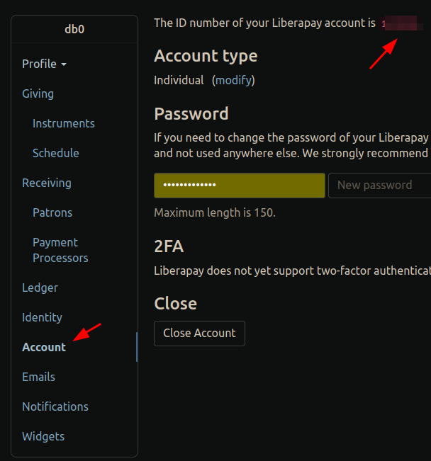

# Threativore Usage Manual

This bot control is currently via PMs. Soon I'll be added a REST API interface as well however.

This means that user and filter management happens through PMing it specifically formatted texts.

## Filters

The bot uses regexp filters to catch easily detectable spam comments as defined by the people in charge.

### Add

Send the PM in the following markdown format

```
threativore add comment filter: `trial period`
reason: `Spam comment`
action: `REMOVE`
description: `Known spam string`
```

You can use whitespace instead of linebreaks if you want, but you **have** to wrap the variables in `backticks`

If the filter was added succesfully, you will receive a reply back informing you of the changes.

The various fields are:

* filter: the regexp to use when searching posts
* reason: the reason to use for the modlog
* action: what type of action to take when this filter is triggered. The options are
   * REMOVE: Remove the comment/post
   * BAN7: Remove and Ban for 7 days
   * BAN30: Remove and Ban for 30 days
   * PERMABAN: Remove and Ban forever
   * REMBAN: Remove and Ban forever and delete all existing comments
   * REPORT: Automatically report the comment/post
* description: internal description for the filter to be used by admin collaboration.

Also important, the initial format has to be somewhat consistent
* The PM needs to start with `threativore`
* the `comment` in "threativore add **comment** filter" is a keyword and **shouldn't** be wrapped in `backticks`. The available options are
   * comment: a filter for comments
   * report: a filter for reports
   * url: a filter for post urls
   * username: a filter for commenter/poster usernames

### Remove

Similar format like [#Add](#add) but use "remove" instead and you only need the filter type (i.e. "comment") and the regex. I.e.

```markdown
threativore remove comment filter: `trial period`
```
### Modify

Similar format like [#Add](#add) but use "modify" instead and you only need the filter type (i.e. "comment"), the regex, and then the updated regex, or any other changing fields. Keep in mind that the filter_type here (e.g. "comment") will changed on the filter if it's different

 I.e.


```
threativore modify report filter: `trial period`
new filter: `trial run`
reason: `Spam comment`
action: `REMOVE`
description: `Known spam string`
```

### Show

Use this format to show all filters matching the provided regex. The bot will report with all the details of each filter which has this string in their regexp

```
threativore show comment filter: `period`
```

### List

Use this format to show all filters of a specific type

```
threativore list comment filters
```

## Users

Only specific users have access to define the configuration of this bot

There's three user roles

#### ADMIN

The bot has one admin, which is defined in the `.env`. The admin role cannot be removed or added any other way, and it's the only one which can add new moderators

#### MODERATOR

Any user can be a moderator (even from other instances). Moderators have access to see and modify all filters and to add trusted users

#### TRUSTED

Any user can be trusted (even from other instances). Trusted users' reports get preferrential treatment and they can also be given some command permissions

#### KNOWN

Any user can be known (even from other instances). Known user's posts are always considered ham (i.e. not spam). Use this to mark the users who might be otherwise be making posts which might trigger the filter.

Note that ADMINS, MODERATORS and TRUSTED users are automatically considered KNOWN

### Add Roles

The bot allows you to set new roles via PM. To do so, you need to use this format

```
threativore add user: [@db0@lemmy.dbzer0.com](https://lemmy.dbzer0.com/u/db0)
role: `moderator`
```

The user **has** to be in url format, i.e. `https://lemmy.dbzer0.com/u/db0`, not `@db0@lemmy.dbzer0.com`. You can also use the lemmy autocomplete for user accounts however. The markdown hyperlink will also work.

### Remove roles

Works the same way, but use `remove` instead of `add`. E.g.

```
threativore remove user: https://lemmy.dbzer0.com/u/db0
```

If you do not pass a role name, it will remove all roles you are allowed to remove from that user

### Appeals

For appeals to work, you need to do one of two things

1. Populate `THREATIVORE_APPEAL_USERNAMES` with a comma-separated value of admin handles, such as `db0@lemmy.dbzer0.com`. These will receive a PM with any appeal requests sent to the threativore and the messages you can use to handle them.
1. Populate `DISCORDWEBHOOK` and/or `SLACKWEBHOOK`. These webhooks will also receive a message with the appeal instructions.

Only people set as threativore mods can resolve appeal requests.

### Override

If you are supporting your instance through Liberapay, or if you're using Ko-Fi with a different email than the one you used to subscribe to your instance, you can set an `override` for your user so that threativore can match your contributions to your user account

To do so, all you need to do is send a PM to the threativore bot on your instancee with the message

`threativore set override: <your email/id>`

Where you must replace `<your email/username>` accordingly

* For Ko-fi, you need to put the same email address you used to register your account in Ko-Fi
* for liberapay, you need to put your user ID as it is shown in your account page.
   
   **Note**: If you need to troubleshoot, don't post your liberapay publicly, as someone else might send an override with your ID.

### Vouching for others

Any a trusted member of the instance can vouch for others. The amount of times they can vouch can be set using `VOUCHES_PER_USER` env var. Trusted users are anyone with the `TRUSTED` role, and you can define users to automatically receive the `TRUSTED` role using the env vars `TRUSTED_TIERS` and `TRUSTED_TAGS`. 

A vouched user becomes `KNOWN` to the instance, which means their comments and posts will be ignored by the threativore anti-spam filter. A vouched member can also take part in voting for the instance.

To vouch for a user PM the threativore bot on your instance with the message

`threativore vouch for: @<target username>`

`<target username>` **has** to be prepended with a `@` and optionally allow the instance domain at the end (.e.g `@db0@lemmy.dbzer0.com`). If an instance domain is not provided at the end, the threativore instance domain will be assumed. Do not create a markdown link with the username (the UI might try to autofill that). 

You can withdraw vouches for users you've vouched for using this command

`threativore withdraw vouch for: @<target username>`

using the same rules as before for `<target username>`

## Governance

You can specify one community in your instance which will be used as threativore as a governance instance, in which to run votes and discussions.

Threativore will constantly poll that comm (every 15 mins) to see new posts and also updates on existing ones. When a new post is detected, it can be marked either as voting, or non-voting. Voting threads will eventually expire and be locked. Non-voting ones will stay open indefinitelly. 

By default all threads are simple majority voting, but you can specify a non-voting thread by adding `governance type: sense check` in the body. Governance threads **must** include a body, or they will be locked immediately.

In addition,you can add `expiry: <number in days>` where `<number in days>` is anything you want with a min of 1 day and a max of 30 days.

(More voting types than simple majority will be added in the future)

If it's a voting thread, the votes happen via the normal upvote/downvote arrows. Anyone can vote, but threativore only takes into account **voting** members. These can be specified automatically using `TRUSTED_TIERS`, `VOTING_TIERS`, `TRUSTED_TAGS`, and `VOTING_TAGS` in the envs. TRUSTED members of threativore by default have voting rights. Vouched-for users also have voting rights.

The difference between `TRUSTED` and `VOTING` for governance, is that only `TRUSTED` can open new threads. This is subject to change in the future.

When a voting thread is opened, threativore will open a "control comment" as distinguished and start editing it to tally up all valid votes cast. The votes will be represented using the user's most significant flair (The order of significance can be set using `VOTING_FLAIR_PRIORITY` env var.) with a total also posted at the end. This means a OP could have 100 of votes but only a dozen counted ones in the tally. This should prevent internal voting process from being manipulated from outsiders and having to rely on comments and manual counting.

People can also leave comments, but they are not used for voting. However to make it more obvious who is commenting, until frontends are developed to display threativore flairs, threativore will reply *only to top level comments* with the user's most significant flair. This doesn't have any effect, but I hope it helps people know the weight of the one commenting. If someone doesn't have any voting rights, or significant non-voting flair, the flair defined in `OUTSIDER_EMOJI` will be used instead. 

When a thread expires, it will be locked and the final tally will be posted on the "control comment"

## Adding/Removing flairs

Moderators of threativore can use PMs to the bot to add remove flair from users. The user will be informed of the flair change and who requested it, unless you explicitly specify to hide it (see below)

The syntax is:

```
threativore [assign|remove] flair <emoji_shortcode>: @<username> ([silently|anonymously])
```

* Use `assign` to assign the flair and `remove` to remove the flair
* <emoji_shortcode> should be an existing `flair` emoji that is predefined in the instance.
* <username> should be the username. Don't forget the `@` sign in front
* You can optionally append `silently` or `anonymously` at the end. 
   * `silently` will not inform the user at all
   * `anonymously` will hide the username of the mod who took the action.

The flair name can be either the tag set in threativore, or the emoji shortcode set in lemmy. As an example, either of these two will have the same effect (assuming your home instance is `lemmy.dbzer0.com`):

```threativore assign flair pirate: @db0```

```threativore assign flair jolly_roger: @db0@lemmy.dbzer0.com```


